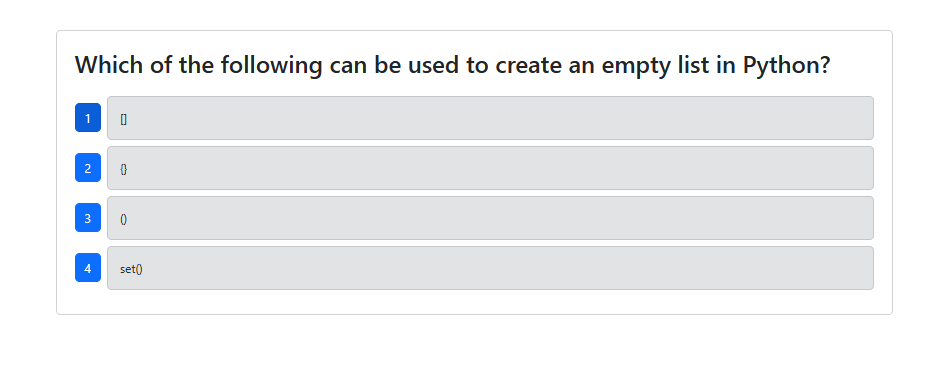
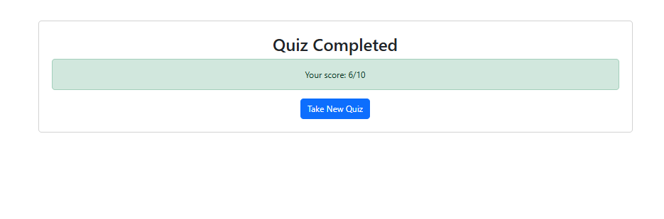

# Python Quiz

## Description
Python Quiz is a an application built with React, Mongoose, Express, and Node.js and features a 10 question quiz about the Python coding language.Once all 10 questions are answered the user is presented with their score and a button that allows this to retake the quiz.

## Display

## Installation
N/A

## Usage
To use this app, click the Start Quiz button to begin the quiz. To choose an answer choice click one of the buttons (labeled 1-4). Once you've finished answering all the available questions you can view your score and now given the option to retake the quiz. For further instruction on how to use this app, please view the following video:

Walkthrough Video: https://screenrec.com/share/vJOL2dXEeP

## Tests
This project uses Cypress for testing.

### Tests Covered
- **Landing Page Component**
  - Button renders with correct text
  - Button loads questions when clicked

- **Questions**
  - Additional Questions load after the previous one is answered

- **Quiz Completion**
  - Shows final score after last question is answered
  - Restarts quiz when Take new quiz button is clicked

## Contributors
N/A

## License
N/A